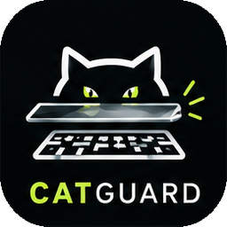
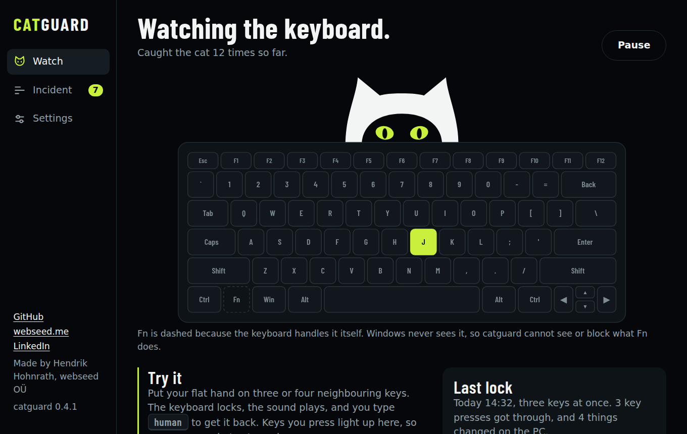
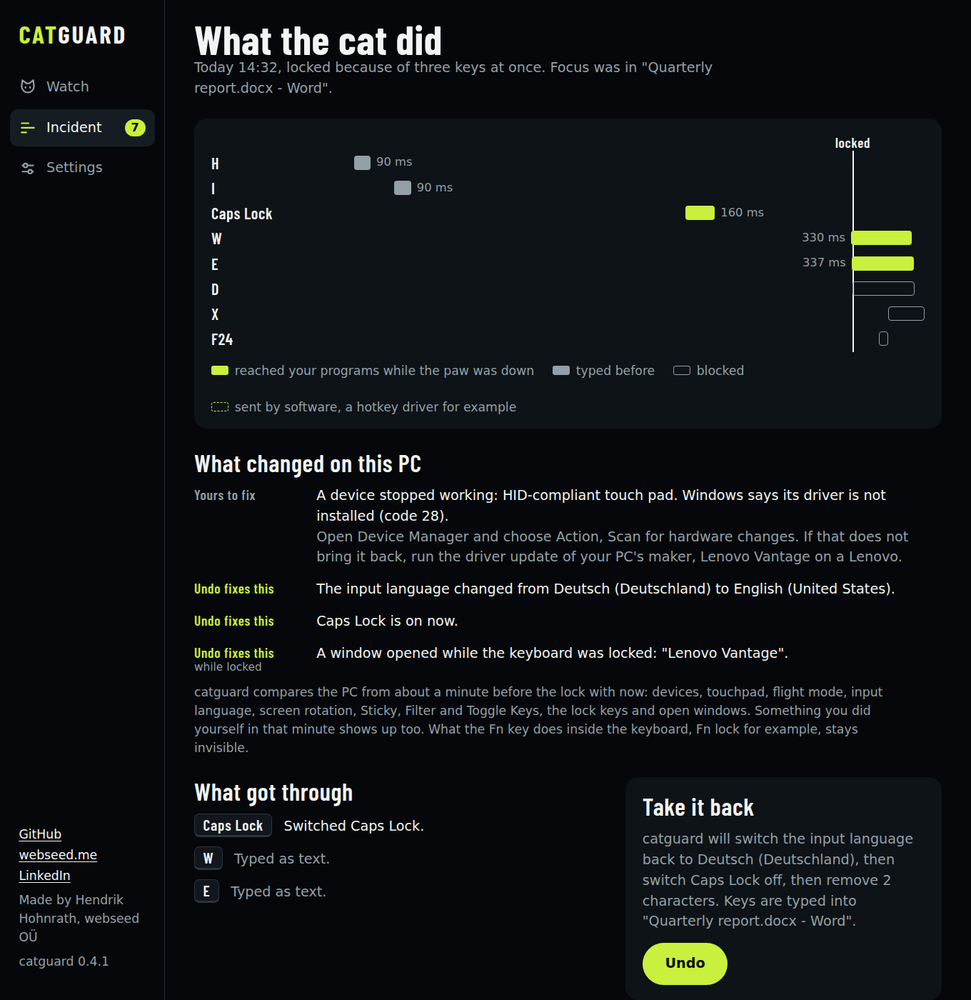
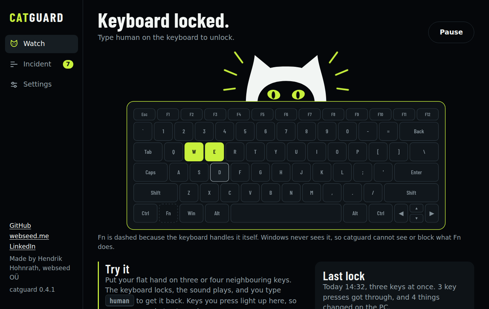
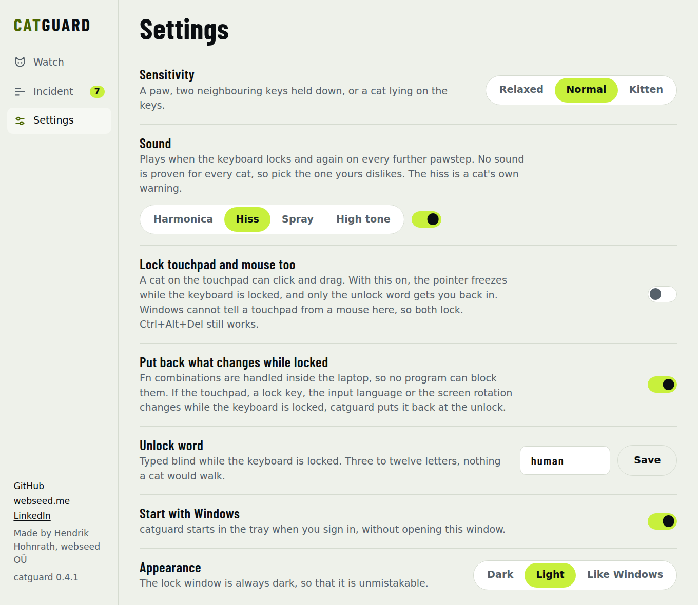

<p align="center">
  
</p>

<h1 align="center">catguard</h1>

<p align="center">
  Locks the keyboard the moment a cat steps on it.<br>
  Then shows what the cat did, and takes back what a program can take back.
</p>

<p align="center">
  <a href="https://github.com/desperad000s/catguard/releases/latest"></a>
  
  
  <a href="LICENSE"></a>
</p>

<p align="center">
  <a href="https://github.com/desperad000s/catguard/releases/latest"><b>Download for Windows</b></a>
  &nbsp;&nbsp;&nbsp;&nbsp;
  <a href="#how-it-tells-a-paw-from-a-hand">How it works</a>
  &nbsp;&nbsp;&nbsp;&nbsp;
  <a href="#build">Build it yourself</a>
</p>

<p align="center">
  
</p>

## Why this exists

My cat jumped on my laptop and the touchpad was dead afterwards. I assumed she
had hit Fn+F10. She had not. A driver had gone missing, and I only found out
after a driver scan from the manufacturer. Locking the keyboard is the easy
half. The half I wanted is the answer to "what did she do?".

I found no free program that does both, so I wrote one.

## What it does

- **Locks at once.** Three keys under one paw lock the keyboard on the third
  key. catguard also catches a cat that lies down on the keys, and a paw on a
  laptop keyboard that only reports two keys. Fast typing does not set it off.
- **Leaves the mouse alone, unless you say otherwise.** Only the keyboard
  locks. A setting freezes touchpad and mouse too, for cats that click.
- **Unlocks for humans.** Type `human` blind, or click the button. The word
  is yours to change.
- **Makes a noise cats dislike.** A harmonica, a hiss, a burst of compressed
  air or a high tone. All four are synthesized, none is a recording.
- **Shows what the cat did.** A timeline has every key around the lock, how
  long it was down, and whether it reached your programs.
- **Shows what changed on the PC.** Devices that stopped working, the
  touchpad, flight mode, the input language, Sticky and Filter Keys, a rotated
  screen, closed windows. Undo puts back what a program can put back.
- **Stays small.** One exe under 1 MB. In the background it is a keyboard
  hook and a tray icon. No network access, no telemetry, and the key history
  lives in memory for three seconds.

<table>
  <tr>
    <td width="50%"></td>
    <td width="50%"><br><br></td>
  </tr>
  <tr>
    <td align="center"><sub>What the cat did, what changed, and Undo</sub></td>
    <td align="center"><sub>Locked, and the settings in the light theme</sub></td>
  </tr>
</table>

## Install

1. Download `catguard-setup-x.y.z.exe` from the
   [latest release](https://github.com/desperad000s/catguard/releases/latest).
2. Run it. It installs for your Windows account only, without administrator
   rights, adds a Start menu entry and an uninstaller, and starts catguard in
   the tray when you sign in.

`catguard.exe` from the same release runs on its own, without installing.

**Windows and your browser will warn you.** I have not code-signed the files
yet, so SmartScreen says "unknown publisher" and Chrome may hold the download
back. Every new unsigned program gets this, and [Signing](#signing) says what
it takes to change. Until then, compare the SHA-256 on the release page with
your download, then choose "More info" and "Run anyway".

## Use it

The tray icon is a cat in a ring. The ring is lime while catguard watches and
grey while it is paused. A left click opens the app, a right click has pause
and exit. Closing the app window does not stop catguard. It keeps watching from
the tray.

When a paw lands, a black window says so and the keyboard goes dead. Type
`human` (you do not need to click anything first) or click the button. Keys
the cat is still standing on stay dead until it lets go.

`Ctrl+Alt+Del` always works. Windows does not let any program intercept it.

The app has three pages:

- **Watch** shows whether catguard is on, and your own keyboard. The keycaps
  follow your layout, and keys light up as you press them, so you can try a
  flat hand and see what catguard sees. A button locks the keyboard by hand,
  for wiping it.
- **Incident** shows the last lock. The next section describes it.
- **Settings**: sensitivity (relaxed for gamers, normal, kitten), the sound,
  locking touchpad and mouse too, putting back what changes while locked, the
  unlock word, start with Windows, dark or light.

There are four sounds. A harmonica, a cat's hiss, two bursts like a can of
compressed air, and a tone at 15 to 17 kHz that most adults barely hear. I
know of no proof that any of them works on every cat, so pick the one yours
dislikes.

The app window is a WebView2 page that exists only while it is open. WebView2
is part of Windows 11 and of current Windows 10. Without it the guard still
works and only the window is missing.

## What the cat did

The incident page draws a timeline: one row per key, one bar per press, as
long as the key was down. Lime bars reached your programs while the paw was
down, grey bars are what you typed in the three seconds before, outlined bars
were blocked. If anything got through, the app opens on this page right after
the unlock.

Below the timeline catguard names what got through. For combinations it knows
(Alt+F4, Ctrl+W, Win+D, Caps Lock, mute, the touchpad key, about thirty
in all) it says what they do and, where there is one, how to take it back by
hand.

The undo button does two things and says which before you click:

- It presses a switch again: Caps Lock, Num Lock, Scroll Lock, Insert, mute,
  play/pause, Win+D, the colour filter, Narrator, and Ctrl+Win+F24, which is
  what laptops with a precision touchpad send for the touchpad key. Win+M is
  answered with Win+Shift+M.
- It sends Backspace once per typed character, but only if characters were
  all that arrived and you have not typed since.

Undo first hands the focus back to the window the cat typed into, and types
nothing if that window is gone.

catguard sees keys, not what a program did with them. A
closed tab or a deleted file is the program's to restore. And anything the Fn
key does inside the keyboard never reaches Windows. Fn+Esc (Fn lock) on a
Lenovo is switched by the keyboard controller. No program can see it, block
it or reverse it.

The history covers three seconds, lives in memory, and is never written
anywhere.

### What changed on the PC

Keys are half the story. A dead touchpad can come from Fn+F10, which Windows
never sees, or from a driver that went missing, which no key explains. So
catguard also takes a small picture of the PC every thirty seconds and, after
a lock, compares the picture from about a minute earlier with now:

- devices that are gone, new, or stopped working, with Device Manager's
  problem code (22 disabled, 28 no driver)
- touchpad on or off, flight mode
- the input language
- screen rotation
- Sticky Keys, Filter Keys and Toggle Keys, which long presses on Shift and
  Num Lock switch on
- Caps Lock, Num Lock, Scroll Lock
- windows that closed

Undo puts back what a program can put back: the lock keys, the three
accessibility features, the input language, the rotation, and it presses the
touchpad key again. For the rest the page says what to do by hand. Something
you did yourself in that minute shows up too. What Fn does inside the
keyboard, Fn lock for example, stays invisible to every program.

#### Fn keys

Fn combinations are the hole in every keyboard lock. The laptop handles them
before Windows sees a key, so a cat can still switch the touchpad off with
Fn+F10 or open the maker's tool with Fn+F9 while the keyboard is locked.
catguard does three things about it:

- Some hotkey drivers turn an Fn combination into keys that software sends.
  catguard blocks those while locked, and the timeline shows them with a
  dashed bar.
- It takes a second picture of the PC when the lock falls. What differs from
  that picture at the unlock happened while no human could type, so catguard
  puts it back by itself: touchpad, lock keys, input language, rotation, the
  accessibility features. A setting switches this off.
- Windows that opened while the keyboard was locked are listed, and Undo
  closes them.

An Fn combination that leaves no trace in Windows, Fn lock for example, stays
out of reach.

`catguard.exe --dump-state file.txt` writes what catguard reads of the PC,
for bug reports.

## How it tells a paw from a hand

A finger presses one key. A paw covers two key units and presses everything
under it in the same instant. The detector looks only at which physical keys
are down and when they went down, so the keyboard layout does not matter.

| Rule  | Fires when                                                           | Decides after      |
|-------|----------------------------------------------------------------------|--------------------|
| Slam  | 3 keys under one paw go down within 60 ms (25 ms if in one row)      | 0 ms, on key three |
| Chord | 4 keys are down within 3.5 key units                                 | 0 ms, on key four  |
| Pair  | 2 neighbours go down within 30 ms and both stay down                 | 250 ms             |
| Sit   | 3 keys are held for 2 s                                              | 2 s                |

Slam can decide at once because any three keys that fit under a paw across
two rows include two keys of the same finger column, and one finger needs about 100 ms
to get from one key to the next. No typist produces that pattern in 60 ms.

Pair exists because many laptop keyboards cannot report a third key inside the
same block of their matrix. On those a paw looks like two keys, and two keys
are only suspicious once they stay down longer than typing ever holds them.

Shift, Ctrl, Alt and Win never count. catguard ignores input that software
injects, such as macros, the on-screen keyboard and remote desktop.

The thresholds live in `Thresholds::default()` in `src/detector.rs`. They come
from reasoning about hands and paws, not yet from recordings of real cats.

## Known limits

- The keys that arrive before a rule fires reach the application: two
  characters for Slam, two held keys for 250 ms for Pair.
- In games, two neighbouring keys that you press in the same 30 ms and hold,
  W+A for example, look like a paw. Set the sensitivity to Relaxed or use
  Pause in the tray menu.
- Windows hides keystrokes that go to an elevated window from a program that
  is not elevated. While an admin window has the focus, catguard sees nothing.
- The exe is not code-signed, so browsers and SmartScreen warn about an
  unknown publisher. See "Signing" below.
- A global keyboard hook is also what a keylogger uses, so antivirus software
  may ask questions about an unsigned build. Read `src/win.rs` and
  `src/history.rs`: the hook keeps the last three seconds of key codes in
  memory for the timeline and nothing else.
- Backspace undo counts key-downs. A dead key (`^`, `´` on a German layout)
  types nothing by itself, so the count can be one too high.
- Whether your laptop sends Ctrl+Win+F24 for the touchpad key shows in the
  timeline the first time it happens.

## Build

```
cargo test                      # the detection core, on any OS
cargo build --release           # on Windows, MSVC toolchain
cargo xwin build --release --target x86_64-pc-windows-msvc   # from Linux
makensis -DVERSION=0.4.1 installer/catguard.nsi                # the setup
python3 assets/make_icons.py    # all icons from one drawing; rsvg-convert, Pillow
tests/wine-smoke.sh             # the real exe under Wine: lock, swallow, unlock
```

The Linux build needs `cargo install cargo-xwin` plus `lld` and `llvm`
(`lld-link`, `llvm-rc`). The MSVC target matters: it links the WebView2
loader and the C runtime statically, so the result is a single exe. The GNU
target would need `WebView2Loader.dll` next to it.

To look at the app without Windows, open `ui/index.html` in a browser. It
runs on demo data there: `?page=incident`, `?page=settings`, `?theme=light`,
`?mode=paused`, `?mode=locked`.

## Signing

Windows and Chrome warn because nobody has vouched for the exe. No setting in
the program changes that. A publisher name needs a certificate, and even
with one SmartScreen keeps warning until enough people have installed the
signed file. The realistic routes for this project:

- SignPath Foundation signs open-source projects for free. It wants a public
  repository, an OSI licence, a release, and a build that runs in CI.
- Azure Artifact Signing, about 10 USD a month, is open to companies in the
  EU and to individuals in the USA and Canada.

Until then the exe and the setup carry version information naming webseed
OÜ, and the download page should publish their SHA-256. An installer does
not remove the warning. It is unsigned too, and the same rules apply to it.

## Layout

- `src/layout.rs`: where each scancode sits on the board
- `src/detector.rs`: the four rules
- `src/guard.rs`: lock state, which events get swallowed, the unlock word
- `src/history.rs`: the three-second history, known shortcuts, the undo plan
- `src/sound.rs`: the four synthesized sounds
- `src/snapshot.rs`: comparing the PC before and after a lock
- `src/settings.rs`: the settings file and its sanitizing
- `src/win.rs`: hook thread, tray, lock window, the app window and its messages
- `src/win_state.rs`: reading the PC's state from Windows and putting it back
- `ui/index.html`: the app, one file, no build step
- `assets/`: every icon, rendered by `make_icons.py` from one vector drawing
- `installer/catguard.nsi`: the per-user setup
- `tests/wine-smoke.sh`: end-to-end check of the exe under Wine

## Credit

The idea comes from PawSense by Chris Niswander (BitBoost, 1999). catguard
shares no code with it. The rule set started from the description in
[joeyvigil/pawsense](https://github.com/joeyvigil/pawsense) (MIT). The app is
set in [Barlow Condensed](https://github.com/jpt/barlow) (SIL Open Font
License).

## Who made this

<table>
  <tr>
    <td width="96"></td>
    <td>
      <b>Hendrik Hohnrath</b>, <a href="https://webseed.me">webseed OÜ</a><br>
      I build websites and the tools around them. catguard is what happens when the cat wins once too often.<br><br>
      <a href="https://webseed.me">webseed.me</a>
      &nbsp;&nbsp;&nbsp;
      <a href="https://www.linkedin.com/in/hendrik-hohnrath-02b390b3">LinkedIn</a>
      &nbsp;&nbsp;&nbsp;
      <a href="https://github.com/desperad000s">GitHub</a>
    </td>
  </tr>
</table>

Found a bug, or does your cat beat the detector? Open an
[issue](https://github.com/desperad000s/catguard/issues) and attach the output
of `catguard.exe --dump-state state.txt` if the PC's state is involved.

MIT licensed. See [LICENSE](LICENSE).
